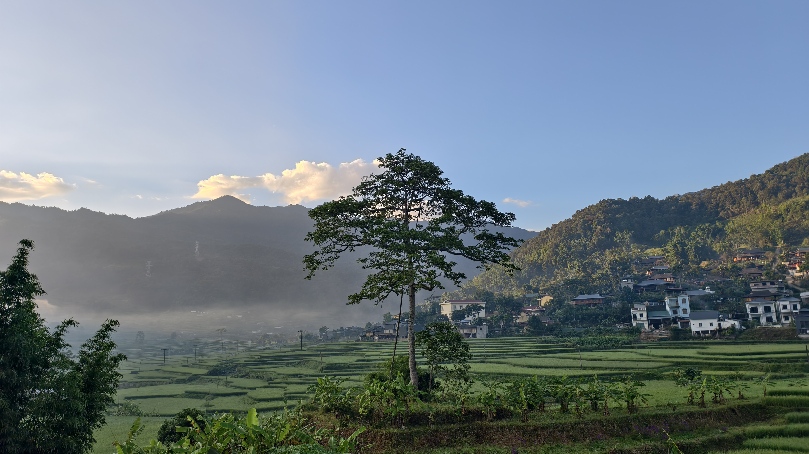
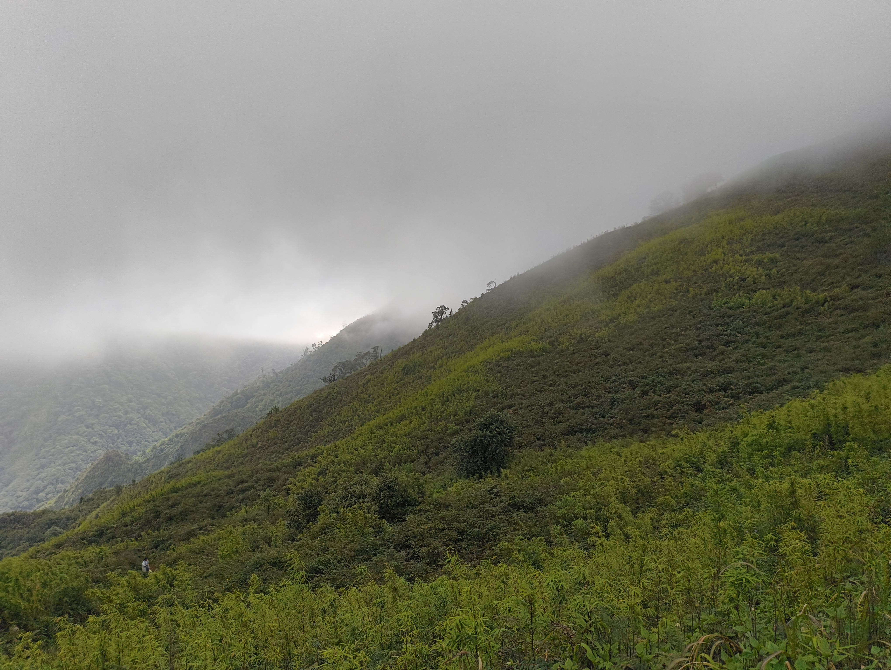

## 1. Xuất phát từ Hà Nội
Sau lần đi tự túc Phu Sa Phìn vừa vất vả vừa tốn kém, lần này tôi chọn đi theo đoàn cho đỡ phải nghĩ. Xe dự kiến xuất phát từ Hà Nội lúc 8 giờ tối ngày 19/9/2025, nên tan làm là về ăn cơm rồi đi luôn. Đồ đạc phải chuẩn bị từ mấy hôm trước, không có gì mới ngoài cái gậy trekking vừa mua, còn lại vẫn là quần áo, thuốc men, đèn và vài thứ lặt vặt quen thuộc.

Tôi rời nhà lúc 7 giờ tối, đi sớm cho chắc, muộn giờ thì phiền người khác mà cũng chẳng giải quyết được gì. Đến điểm tập trung mới 8 giờ kém 20, còn khá sớm, đủ thời gian ngồi trà đá làm quen mọi người và chờ các bạn đến muộn — một phần gần như mặc định khi đi theo đoàn.

Đến khoảng 8 giờ 30 thì đủ người, xe bắt đầu lăn bánh lên Trạm Tấu. Đi theo đoàn đúng là đỡ mệt phần chuẩn bị, đổi lại là phải chấp nhận lịch trình chung và nhịp đi của số đông. Với tôi, lần này như vậy là hợp lý.
## 2. Nghỉ đêm ở Trạm Tấu
Chưa leo núi chút nào mà chân tôi đã rã rời vì ngồi xe hơn 4 tiếng. Đến Trạm Tấu thì trời gần sáng, cả đoàn vội nhận phòng rồi đi ngủ để vớt lại chút sức cho chặng đường sắp tới.

Buổi sáng ở thị xã vùng cao khá dễ chịu, trời mát, không khí trong lành, báo hiệu một ngày nắng. Rút kinh nghiệm lần trước đi Phu Sa Phìn, do chủ quan không che nắng kỹ nên về bị cháy nắng bong cả mảng da ở gáy, lần này tôi mang theo mũ có che gáy cho chắc. Đi một chuyến là học thêm một bài, dù hơi muộn.
## 3. Xuất phát từ mỏ chì
Ăn sáng xong, đoàn di chuyển đến điểm trekking trước cổng mỏ chì. Ở đây đã có sẵn vài chiếc xe 29 chỗ, cộng với các xe gặp dọc đường, tôi đoán chuyến này số người lên đỉnh phải trên 200. Đúng mùa hoa chi pâu nên đông cũng không lạ, cảm giác như một ngày hội hơn là một chuyến leo núi.

Vấn đề phát sinh ngay trước giờ xuất phát là nhu cầu đi vệ sinh. Hỏi thằng em dẫn đoàn xem có thể đi nhờ phía mỏ không thì nó lắc đầu, chỉ ra suối. Đành chấp nhận. Nghĩ đến cảnh hơn 200 người ở đây, phần lớn là nữ, tôi mới thấy chuyện tưởng nhỏ này lại khá bất tiện.
## 4. Hành trình và điểm dừng lán 2900m
Chặng đầu là đoạn đường vòng qua mỏ chì. Có lẽ do mới bắt đầu nên ai cũng còn sức, mọi người đi khá nhanh, không ai dừng lại chụp ảnh. Đi được một đoạn thì đoàn bị chặn lại bởi một cổng tạm dựng bằng cành cây. Một anh người dân tộc đứng thu tiền, hóa ra lối này đi qua ruộng nhà họ. Cách làm kinh tế đơn giản nhưng hiệu quả.

Nắng bắt đầu làm mọi người xuống sức nhanh hơn, một vài người trong đoàn đã tụt lại phía sau. May là đoạn này vẫn đi trong rừng, còn nhiều bóng mát. Lúc đó mới thấy cái mũ che cả đầu và cổ phát huy tác dụng, vừa tránh nắng vừa hạn chế côn trùng.

## 5. Lên đỉnh và xuống núi
## 6. Về Hà Nội