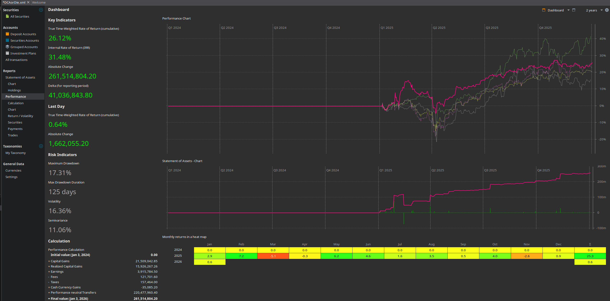

## TL;DR

- **TWRR:** ~**26%**
- **IRR:** ~**31%**
- **Lãi tuyệt đối:** ~**40 triệu**
- **Max drawdown:** ~**17%**
- **Danh mục:** boring, phòng thủ, sống sót tốt hơn cái tôi

Không phải năm khoe khoang. Là năm chứng minh: _không ngu_ > _thông minh_.

## 1. Hiệu suất tổng thể

- **Time-weighted return (TWRR): ~26%**  
  So với VNIndex ~40% thì **thua chỉ số**. Không né.  
  Nhưng:
  - VNIndex kéo bởi họ Vin + vài trụ đầu cơ
  - Danh mục tôi = thủy điện, nước sạch, vật liệu → _không tham gia sòng bạc_

- **IRR ~31%**  
  DCA đúng nhịp thị trường điều chỉnh → tiền vào lúc giá thấp, không phải lúc hưng phấn.

- **Lợi nhuận tuyệt đối:** ~**40 triệu**  
  Tiền thật. Không phải % trên giấy.

## 2. Rủi ro & tâm lý

- **Max drawdown ~17%**, kéo dài **~125 ngày**  
  Không vui. Nhưng:
  - Không margin
  - Không bán đáy
  - Không hoảng loạn đọc tin tức vớ vẩn

=> Drawdown mà không làm gì ngu thì **không gọi là rủi ro**, chỉ là _noise_.

## 3. Danh mục – thắng thua rõ ràng

### Làm đúng

- **VNDIAMOND ETF**  
  Nếu chỉ mua mỗi thằng này thì 2025 còn ngon hơn. Bài học nhớ đời.
- **FPT / BWE / BMP / DRL**  
  Doanh nghiệp thật, dòng tiền thật, không cần kể chuyện.

### Làm chưa tốt

- **Thủy điện** (SHP, VPD, CHP…)  
  Chậm. Rất chậm. Đúng kiểu “ông cụ”.
- **US stocks nhỏ lẻ**  
  Lãi thì có, nhưng **không đáng công theo dõi** so với ETF + big tech.

## 4. Những gì KHÔNG làm (và tự hào vì thế)

- Không trading
- Không bắt đáy
- Không xoay danh mục theo tin
- Không FOMO Vin, penny, sóng ngành

2025 dạy lại một chân lý cũ:

> _Đừng làm gì cũng là một quyết định đầu tư._

## 5. Bài học rút ra

1. **ETF core > cổ phiếu lẻ** (trừ khi anh cực kỳ chắc)
2. **DCA không giúp giàu nhanh**, nhưng giúp **không chết**
3. So sánh với index để học, **không phải để tự hành hạ**
4. Đầu tư dài hạn là bài test… _chịu đựng sự nhàm chán_

## 6. Kế hoạch 2026 (ngắn gọn, không mơ mộng)

- VNDIAMOND tiếp tục là **core**
- Giữ ~8–10 mã tối đa
- Không thêm cổ phiếu “cho vui”
- Tăng tiền nạp đều → _để thời gian làm việc hộ_

## Kết

2025 không phải năm tôi thông minh hơn thị trường.  
Chỉ là năm tôi **ít ngu hơn chính mình năm trước**.

Thế là đủ.

_DCA or Die. Nhưng tốt nhất là… đừng die._
